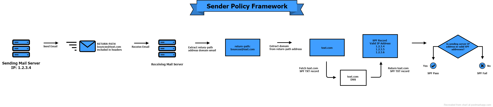

- - - -

#### The Problem

when:

* the local XMail server delivers an email to a remote SMTP server that authenticates the _return path_ with [SPF](https://www.duocircle.com/content/sender-policy-framework)

then:

* the [IP address](https://httpbin.org/ip) of the local XMail server must pass an [SPF record check](https://www.duocircle.com/email/spf-record-check)
  - the domain of the [return path](https://github.com/warren-bank/mirror-XMail-mail-server/blob/1.27/MailRoot/server.tab#L5-L10) must contain a DNS TXT record that permits this IP



- - - -

#### Dynamic DNS Solution

requirements:

* a DDNS service that provides a subdomain and allows a custom TXT record

example:

* [duckdns.org](https://www.duckdns.org/)
  - completely free
  - HTTP API to update IP and TXT record

DDNS configuration:

* subdomain: `xmail-server.duckdns.org`
* TXT record: `v=spf1 +all`
  - permits all IP addresses

XMail configuration:

* file: _./MailRoot/server.tab_
  ```text
  # ------------------------------------------------
  # domain with permissive SPF record:
  # ------------------------------------------------
  "RootDomain"	"xmail-server.duckdns.org"
  "SmtpServerDomain"	"xmail-server.duckdns.org"
  "POP3Domain"	"xmail-server.duckdns.org"
  "HeloDomain"	"xmail-server.duckdns.org"
  "PostMaster"	"root@xmail-server.duckdns.org"
  "ErrorsAdmin"	"root@xmail-server.duckdns.org"
  # ------------------------------------------------
  # defaults:
  # ------------------------------------------------
  "RemoveSpoolErrors"	"0"
  "MaxMTAOps"	"16"
  "ReceivedHdrType"	"0"
  "FetchHdrTags"	"+X-Deliver-To,+Received,To,Cc"
  "DefaultSmtpPerms"	"MRVZ"
  ```

- - - -

#### Logging SMTP Errors (the hard way)

* _duckdns.org_:
  - automatically creates and updates an MX record,<br>which points to the dynamic IP address
* XMail configuration:
  - `PostMaster` and `ErrorsAdmin` both contain email addresses that are resolved by the _duckdns.org_ MX record

tools:

* [FakeSMTP](https://github.com/Nilhcem/FakeSMTP) works great to log all inbound SMTP messages
  - presumably, much simpler than configuring XMail to do the same
  - steps to run:
    1. download [zip file](https://github.com/Nilhcem/FakeSMTP/raw/gh-pages/downloads/fakeSMTP-latest.zip) and extract: `fakeSMTP-2.0.jar`
    2. run:
       ```text
       java -jar "fakeSMTP-2.0.jar" -m -s -a "0.0.0.0" -p "1025"
       ```
  - which:
    * starts the server
    * listens to all network interfaces on port `1025`
    * stores messages in memory,<br>rather than saving them to disk

router configuration:

* forward TCP requests on port `25` to port `1025` at the _LAN_ IP address of the computer running this test (ex: `192.168.0.2`)

summary of test setup:

* `XMail` is listening on port `25`
* `FakeSMTP` is listening on port `1025`
  - and receiving requests from the _WAN_ that are forwarded from port `25`
  - which includes messages sent to `PostMaster` and `ErrorsAdmin`

- - - -

#### Logging SMTP Errors (the easy way)

XMail configuration:

* update both `PostMaster` and `ErrorsAdmin` to a new email address
  - that you can access
  - that has a server with lax spam filters
    * `gmail.com` and `yahoo.com` email addresses don't receive the bounce messages
    * a randomly assigned [temporary email address](https://internxt.com/temporary-email) works great

* file: _./MailRoot/server.tab_
  ```text
  # ------------------------------------------------
  # domain with permissive SPF record:
  # ------------------------------------------------
  "RootDomain"	"xmail-server.duckdns.org"
  "SmtpServerDomain"	"xmail-server.duckdns.org"
  "POP3Domain"	"xmail-server.duckdns.org"
  "HeloDomain"	"xmail-server.duckdns.org"
  # ------------------------------------------------
  # temporary email address:
  #   https://internxt.com/temporary-email
  # ------------------------------------------------
  "PostMaster"	"n0kd6@chefalicious.com"
  "ErrorsAdmin"	"n0kd6@chefalicious.com"
  # ------------------------------------------------
  # defaults:
  # ------------------------------------------------
  "RemoveSpoolErrors"	"0"
  "MaxMTAOps"	"16"
  "ReceivedHdrType"	"0"
  "FetchHdrTags"	"+X-Deliver-To,+Received,To,Cc"
  "DefaultSmtpPerms"	"MRVZ"
  ```

- - - -

#### Sharing Is Caring

* everybody is welcome to use:
  ```text
  "RootDomain"	"xmail-server.duckdns.org"
  "SmtpServerDomain"	"xmail-server.duckdns.org"
  "POP3Domain"	"xmail-server.duckdns.org"
  "HeloDomain"	"xmail-server.duckdns.org"
  ```
  - the DNS TXT record for the domain `xmail-server.duckdns.org` permits all IP addresses to pass `SPF`

- - - -

#### test &#35;3

configuration:

* `email.txt` changes the value of the `To:` header to contain a randomly assigned [temporary email address](https://internxt.com/temporary-email)

result:

* success
  - the test message is delivered

- - - -

#### test &#35;4

configuration:

* `email.txt` reverts the header:
  ```text
  To: GmailUser <no-reply@gmail.com>
  ```

result:

* partial success
  - SPF passes
* failure
  ```text
  XMail bounce: Rcpt=[no-reply@gmail.com];Error=
    Unauthenticated email from example.com is not accepted due to domain's DMARC policy.
    Please contact the administrator of example.com domain if this was a legitimate mail.
    To learn about the DMARC initiative, go to:
      https://support.google.com/mail/?p=DmarcRejection
  ```

- - - -
